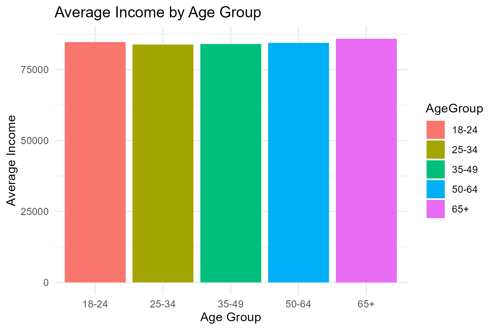
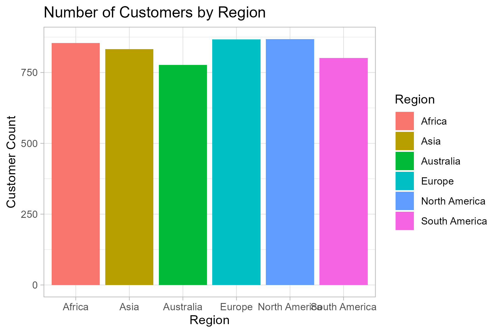
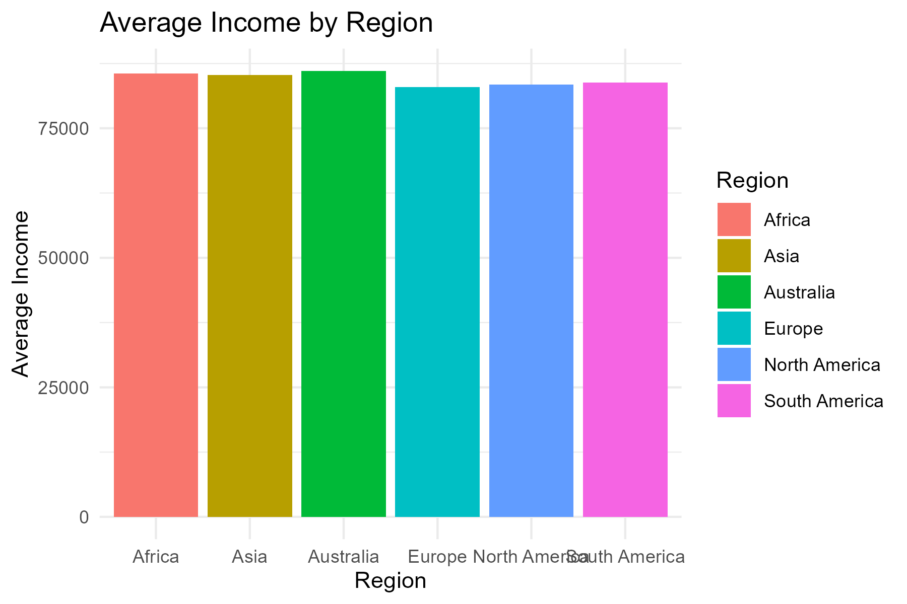
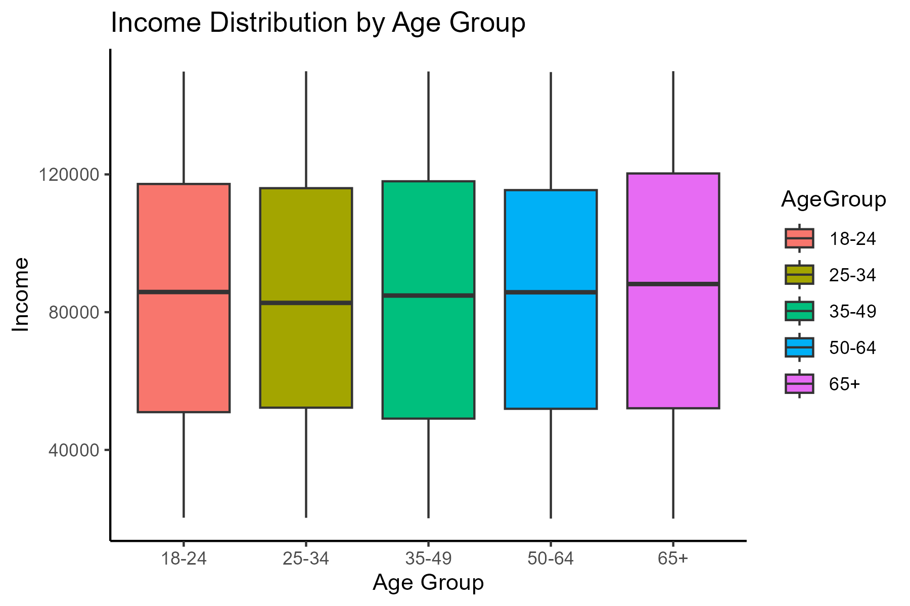
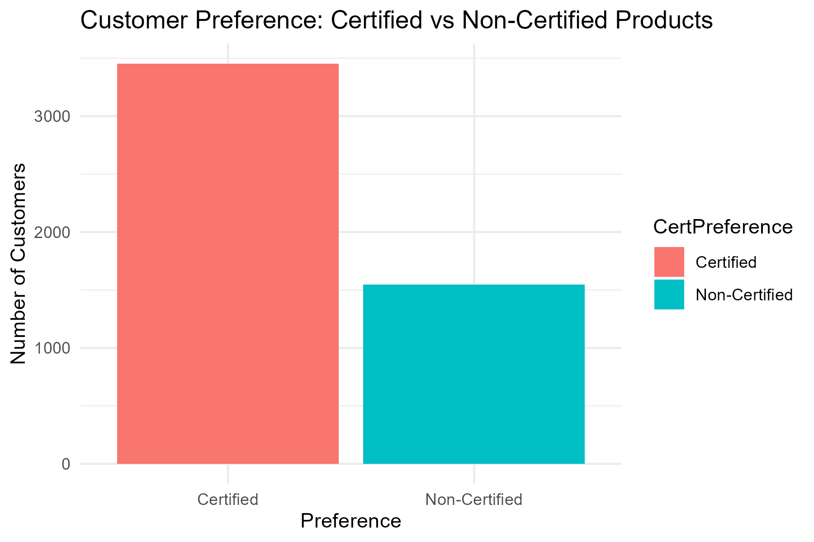

# 📊 EcoTrade Customer Segmentation Using R

This project uses **R and tidyverse** to analyze EcoTrade’s customer demographics and generate actionable insights to support data-driven decisions around **marketing**, **sales**, and **sustainability goals**.

It complements the [Power BI Dashboard version](https://github.com/Ashley-sdev/EcoTrade-CustomerInsights-PowerBI), forming part of a broader business intelligence solution.

## 🧠 Project Objective

To segment EcoTrade customers based on **income**, **age**, and **region**, and visualize:
- Which customer age groups are the most profitable
- Where most customers are located
- Preferences for **certified vs. non-certified** products

## 🔧 Tools & Technologies

- 💻 **R** (Data analysis, cleaning, and visualization)
- 📦 **tidyverse** (dplyr, ggplot2, readr, etc.)
- 📈 **ggplot2** for charts
- 🧼 CSV data: `Customer_Demographics.csv`

## 📂 Folder Structure

EcoTrade-CustomerSegmentation-R/ │ ├── data/ │ └── Customer_Demographics.csv # Raw dataset used for analysis │ ├── plots/ # All generated plots from R script │ ├── income_by_age_group.png │ ├── region_distribution.png │ ├── income_by_region.png │ ├── income_boxplot_by_age.png │ └── certified_vs_noncertified.png │ ├── EcoTrade_Segmentation.R # Main R script for data wrangling and visualization ├── README.md # This file - Project documentation

## 📊 Visuals Created

### 1. Average Income by Age Group

### 2. Customer Count by Region

### 3. Average Income by Region

### 4. Boxplot of Income by Age Group

### 5. Certified vs Non-Certified Product Preference

## 🔍 Summary of Key Insights

- Customers aged **65+** have the **highest average income**
- Most customers come from **Europe**, followed by **Asia** and **North America**
- Simulated preference analysis shows a stronger leaning toward **certified products**
- Younger segments may benefit from **budget-focused eco-friendly offers**

## 🧼 Data Cleaning & Transformation

- Removed records with missing `Age` or `Income`
- Created an `AgeGroup` column with the following buckets:
  - 18–24, 25–34, 35–49, 50–64, 65+
- Added a **simulated column** `CertPreference` using random sampling (70% Certified)

## 🧑‍💻 Author

**Muhle Ntuli**  
Final Year IT Student | Passionate about Cloud, Data, and Analytics  
GitHub: [Ashley-sdev](https://github.com/Ashley-sdev)  
LinkedIn: [[http://www.linkedin.com/in/muhle-ntuli-9a7638342]

## 📎 Related Projects

- 🔗 **[EcoTrade Power BI Dashboard](https://github.com/Ashley-sdev/EcoTrade-CustomerInsights-PowerBI)** – Visual representation of these insights using Power BI
